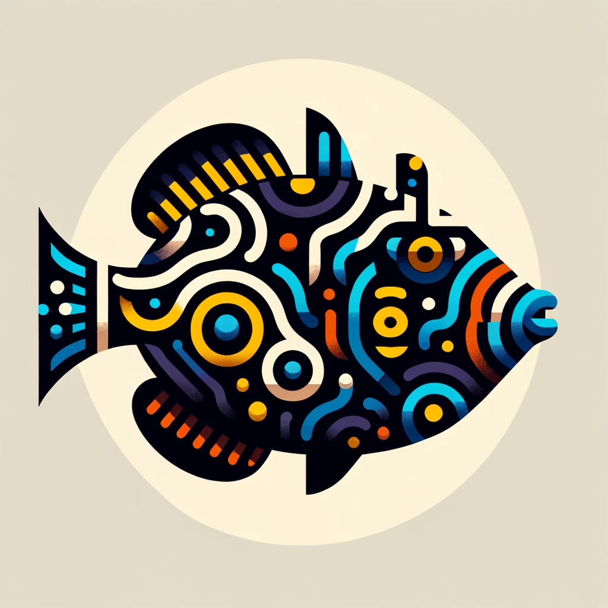

<p align="center">
  
  
</p>
<h1 align="center"; style="font-size:18px; ">Kikande</h1>
<p align="center";"> Stockfish, but for Bao la Kiswahili.


## Usage

Install `rustup` (for instructions on Windows see [here](https://doc.rust-lang.org/cargo/getting-started/installation.html)):

```
curl --proto '=https' --tlsv1.2 -sSf https://sh.rustup.rs | sh -s -- -y
```

### Build

```
cargo build --release
```

### Find the best move
```
cargo run --release search --depth 21 --threads 4
```
```
Player 2: seeds=22, nyumba=[✓]

      8 7 6 5 4 3 2 1
    -------------------
    | 0 0 0 0 0 0 0 0 |
  R | 0 2 2 6 0 0 0 0 | L
  L | 0 0 0 0 6 2 2 0 | R
    | 0 0 0 0 0 0 0 0 |
    -------------------
      1 2 3 4 5 6 7 8

Player 1: seeds=22, nyumba=[✓]


Δt: 2.000712084s
Depth: 21
+/=(5.00): 6L 5R; 3R 5L; 8 8; 2 1; 6R 2; 8 4R; 1 5L; 7 5L; 6R 2L; 8 4L; 7R
```


### Play against the computer
```
cargo run --release play --difficulty 3
```